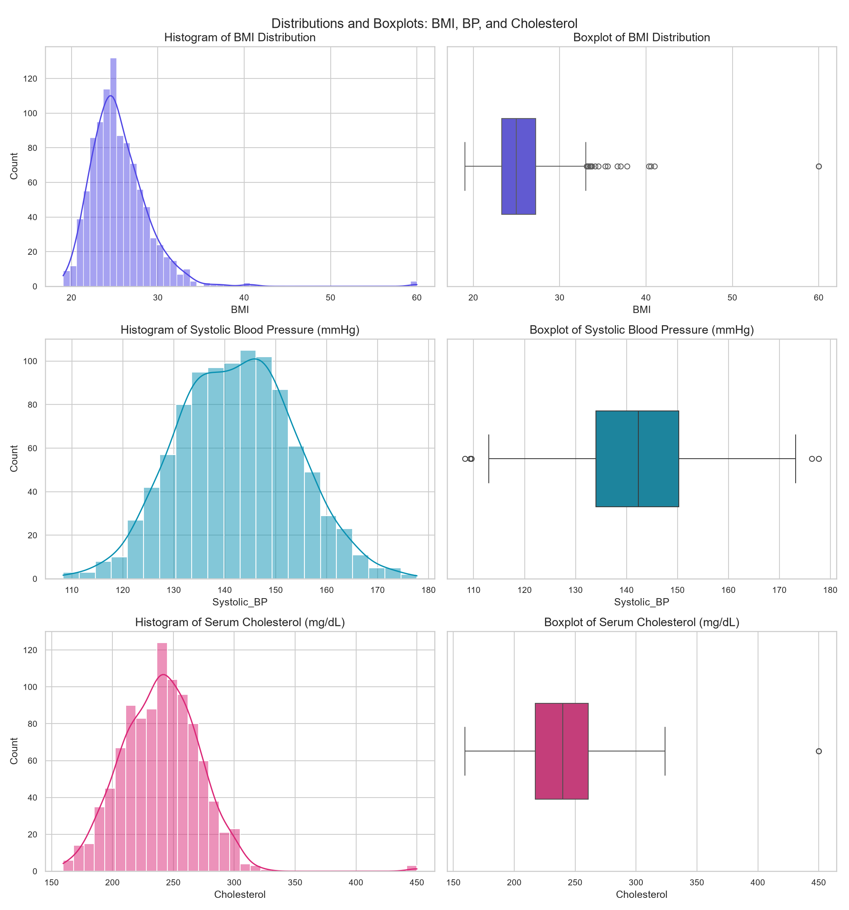
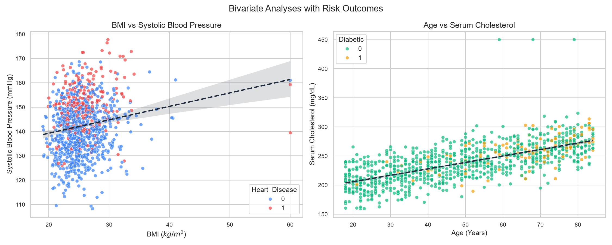
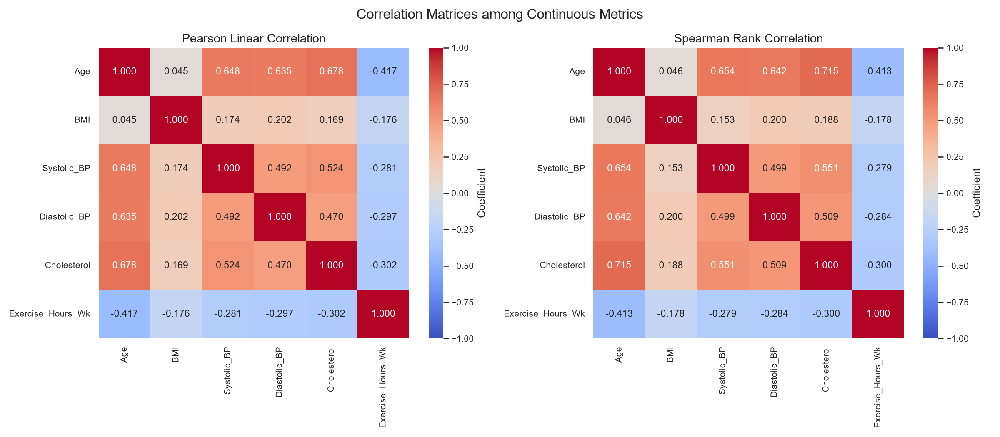
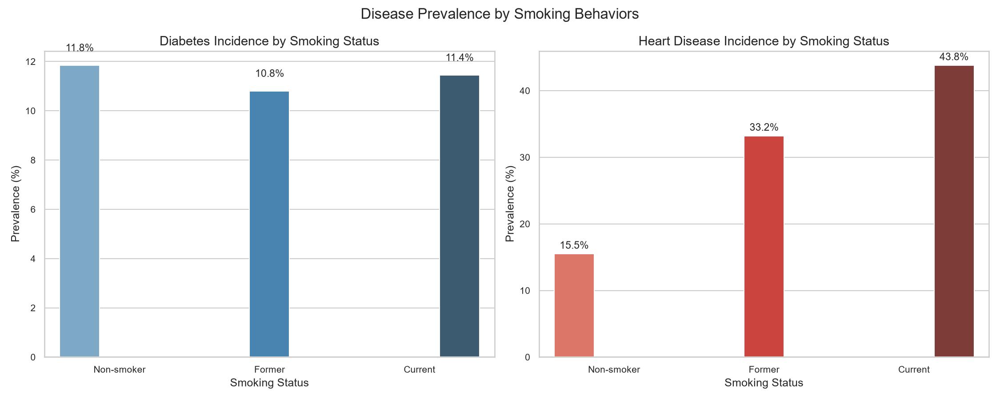

# Structured EDA Report: Health Indicators & Disease Risk Analysis

## 1. Introduction

### Purpose
The objective of this project is to perform a comprehensive **Exploratory Data Analysis (EDA)** on a health database of 1,000 patient records. This analysis aims to uncover underlying distributions, examine relationships between demographic factors, lifestyle habits, and clinical measurements, and identify key predictors for primary chronic outcomes: **Diabetes** and **Heart Disease**.

### Dataset Overview
The dataset contains 1,000 unique patient records (after duplicate removal) and captures a mix of demographic, clinical, and lifestyle features:
- **Demographics**: `Age` (years), `Gender` (Male, Female, Other).
- **Clinical Measurements**: `BMI` ($kg/m^2$), `Systolic_BP` (mmHg), `Diastolic_BP` (mmHg), `Cholesterol` (mg/dL).
- **Lifestyle Factors**: `Exercise_Hours_Wk` (hours of physical activity per week), `Smoking_Status` (Non-smoker, Former, Current).
- **Health Outcomes (Target Labels)**: `Diabetic` (0 = No, 1 = Yes), `Heart_Disease` (0 = No, 1 = Yes).

---

## 2. Methodology

The analysis followed a structured data science pipeline:
1. **Data Ingestion**: Initial load of raw dataset (including duplicate entries, missing values, and extreme outliers).
2. **Data Cleaning & Imputation**:
   - **Duplicates**: Identified and removed 10 duplicate rows.
   - **Missing Values**: Identified 25 missing BMI values and 30 missing Cholesterol values. Both were imputed using their respective median values (BMI Median = **25.0**, Cholesterol Median = **240.0**) to protect distributions from bias.
   - **Outliers**: Outliers were identified using the Interquartile Range (IQR) method (defined as values outside $[Q1 - 1.5 \times IQR, Q3 + 1.5 \times IQR]$). 
   - **Outlier Treatment**: Rather than discarding outliers (which would reduce statistical power), extreme measurement errors (such as BMI of 82.5 or Cholesterol of 620.0) were clipped to clinical boundaries: BMI clipped to `[12.0, 60.0]` and Cholesterol to `[100.0, 450.0]`.
3. **Statistical Summaries**: Calculated descriptive metrics for continuous variables and frequency distributions for categorical factors.
4. **Visual Explorations**: Rendered univariate distributions, bivariate scatterplots, correlation heatmaps, and categorical bar charts.
5. **Correlation & Predictor Analysis**: Evaluated linear and rank-order correlations. Used standardized logistic regression models to compute Odds Ratios (OR) and standardized coefficients ($\beta$) to determine feature importance for disease risk.

---

## 3. Results

### Descriptive Statistics (Continuous Variables)
Below is the statistical summary of the cleaned continuous metrics:

| Variable | Mean | Median | Std Dev | Variance | Skewness | Min | Max |
| :--- | :--- | :--- | :--- | :--- | :--- | :--- | :--- |
| **Age** (years) | 50.68 | 50.00 | 19.78 | 391.26 | 0.001 | 18.00 | 84.00 |
| **BMI** ($kg/m^2$) | 25.54 | 24.98 | 3.60 | 13.00 | 3.161 | 19.03 | 60.00 |
| **Systolic BP** (mmHg) | 142.33 | 142.33 | 11.43 | 130.74 | 0.051 | 108.29 | 177.73 |
| **Diastolic BP** (mmHg) | 86.28 | 86.48 | 8.21 | 67.40 | -0.106 | 57.35 | 111.74 |
| **Cholesterol** (mg/dL) | 239.73 | 239.97 | 32.24 | 1039.12 | 0.743 | 159.47 | 450.00 |
| **Exercise Hours/Wk** | 5.59 | 5.56 | 2.36 | 5.55 | 0.040 | 0.00 | 13.37 |

> [!NOTE]
> - **Age** shows a highly symmetric, near-zero skewness ($0.001$), reflecting a uniform demographic spread.
> - **BMI** exhibits a strong right skewness ($3.161$), representing the presence of an overweight/obese tail in the population.

### Frequency Tables (Categorical Variables)

**Gender Distribution**
- **Female**: 496 patients (49.6%)
- **Male**: 457 patients (45.7%)
- **Other**: 47 patients (4.7%)

**Smoking Status**
- **Non-smoker**: 549 patients (54.9%)
- **Former Smoker**: 250 patients (25.0%)
- **Current Smoker**: 201 patients (20.1%)

**Disease Incidence**
- **Diabetes Prevalence**: 11.5% (115 cases)
- **Heart Disease Prevalence**: 25.6% (256 cases)

---

### Visualizations

#### Univariate Distributions (Histograms & Boxplots)
The chart below shows the distribution characteristics of BMI, Systolic Blood Pressure, and Cholesterol.

#### Bivariate Relationships with Outcome Indicators
The relationship between BMI vs. Systolic Blood Pressure and Age vs. Cholesterol, overlaid with target outcomes, is visualized below:

#### Correlation Heatmaps
This figure displays the Pearson (linear) and Spearman (rank-order) correlation matrices:

#### Categorical Risk Profiles
Prevalence rates of Diabetes and Heart Disease across different smoking groups:

---

## 4. Discussion

### Key Correlation Insights
1. **Age-Driven Physiological Changes**: Age shows a very strong correlation with Serum Cholesterol ($r = 0.678$ Pearson, $r = 0.715$ Spearman) and Systolic Blood Pressure ($r = 0.648$). This suggests that age is a major underlying covariate for metabolic risk.
2. **Exercise as a Counter-Force**: Exercise hours per week are negatively correlated with Age ($r = -0.417$) and BMI ($r = -0.176$). This represents a lifestyle decline as age increases, which in turn compounding BMI elevation and cardiovascular risks.
3. **Blood Pressure Alignment**: Systolic and Diastolic blood pressures are strongly correlated ($r = 0.492$), and both track strongly with Cholesterol ($r \approx 0.47 - 0.52$).

---

### Key Influencing Factors (Predictor Strengths)
To determine the relative importance of factors while controlling for confounding variables, we fitted standardized logistic regression models. The standardized coefficient ($\beta$) represents the effect size per standard deviation change in the feature.

#### 1. Diabetes Predictors

| Feature | Standardized Beta ($\beta$) | Odds Ratio (per SD) | Risk Relationship |
| :--- | :--- | :--- | :--- |
| **Age** | +0.891 | 2.438 | **Strong Risk Factor** |
| **Exercise Hours/Wk** | -0.206 | 0.814 | **Protective Factor** |
| **BMI** | +0.155 | 1.167 | **Moderate Risk Factor** |

- **Interpretation**: Controlling for other factors, a one standard deviation increase in **Age** increases the odds of being diabetic by **143.8%** ($OR = 2.438$). 
- **Exercise** is a significant protective factor: each standard deviation increase reduces the odds of diabetes by **18.6%** ($OR = 0.814$).
- **BMI** increases diabetes risk ($OR = 1.167$), illustrating the metabolic link between body weight and insulin resistance.

#### 2. Heart Disease Predictors

| Feature | Standardized Beta ($\beta$) | Odds Ratio (per SD) | Risk Relationship |
| :--- | :--- | :--- | :--- |
| **Age** | +1.089 | 2.972 | **Primary Risk Factor** |
| **Smoking: Non-smoker** | -0.755 | 0.470 | **Strong Protective Factor** |
| **Systolic BP** | +0.408 | 1.504 | **Major Risk Factor** |
| **Exercise Hours/Wk** | -0.236 | 0.790 | **Protective Factor** |
| **Smoking: Former** | -0.183 | 0.833 | **Moderate Protective Factor** |
| **BMI** | +0.061 | 1.063 | Negligible Direct Effect |
| **Cholesterol** | +0.027 | 1.027 | Negligible Direct Effect |

- **Interpretation**: 
  - **Age** is the single most critical factor for heart disease ($OR = 2.972$).
  - **Smoking Cessation/Avoidance**: Being a **Non-smoker** is the strongest modifiable protective feature, lowering the odds of heart disease by **53.0%** ($OR = 0.470$) compared to the reference group of active smokers.
  - **Systolic BP**: A one standard deviation increase in Systolic BP increases the odds of heart disease by **50.4%** ($OR = 1.504$), demonstrating that hypertension is a critical cardiovascular threat.
  - **Direct vs. Indirect Effects**: Note that BMI and Cholesterol have very small direct effects in this multivariate model. This is because their influence is largely *mediated* through blood pressure (i.e., high BMI and cholesterol cause high BP, which directly drives cardiovascular damage).

---

## 5. Conclusion & Recommendations

### Key Takeaways
1. **The Aging Effect**: Age is the most dominant predictor for both Diabetes and Heart Disease. Standard health checks must scale in intensity as patients cross age thresholds.
2. **Synergy of Modifiable Habits**: Physical inactivity, smoking, and weight gain act in unison to drive up blood pressure and lipid accumulation, which directly trigger cardiovascular and diabetic conditions.
3. **Hypertension as a Primary Signal**: Systolic Blood Pressure represents the most critical clinical indicator for heart disease risk.

### Preventive Guidelines
- **Primary Prevention (Physical Activity)**: Implement clinical guidelines promoting at least **5–6 hours of moderate exercise per week**. This acts as a dual-protective shield, lowering the risk of both Diabetes (by ~19%) and Heart Disease (by ~21%).
- **Cardiovascular Interventions (Blood Pressure & Smoking)**: 
  1. Mandate aggressive screening and treatment protocols for patients with Systolic BP $> 140$ mmHg.
  2. Smoking cessation programs should be a cornerstone of cardiac care, as shifting from active smoker to non-smoker cuts coronary risks in half.
- **Biomarker Management**: Control BMI and Cholesterol levels to indirectly manage blood pressure escalation.

### Future Research Directions
1. **Longitudinal Cohort Study**: A follow-up study tracking patient metrics over 10–15 years would establish true causal pathways rather than cross-sectional associations.
2. **Mediation Analysis**: Execute structured causal mediation models to mathematically isolate the percentage of BMI/Cholesterol effects that flow through hypertension.
3. **Intervention Trials**: Standardize clinical trials to measure the efficacy of combining structured exercise regimes with targeted pharmacological blood pressure control.
